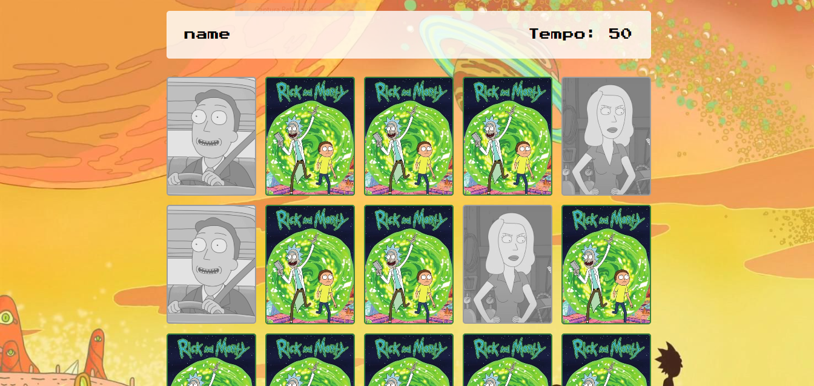

# Jogo da Memória - Rick and Morty Edition

Este é um projeto simples de Jogo da Memória temático de Rick and Morty desenvolvido com HTML, CSS e JavaScript. O jogo apresenta uma tela de login onde o jogador pode inserir seu nome antes de jogar. Durante o jogo, um timer é exibido, mostrando o tempo decorrido até o momento em que todas as cartas forem combinadas.

## Funcionalidades

- Tela de login para inserir o nome do jogador.
- Jogo da Memória temático de Rick and Morty.
- Timer para mostrar o tempo decorrido durante o jogo.
- Interface interativa e amigável.

## Como Jogar

1. Abra o [Jogo da Memória](https://memory-game-phi-jade.vercel.app/) em seu navegador web.
2. Na tela de login, insira seu nome e clique em "Play".
3. O jogo da memória será iniciado. Clique nas cartas para revelar seus pares correspondentes.
4. O timer começará a contar a partir do momento em que você iniciar o jogo.
5. Continue virando as cartas e combinando os pares correspondentes.
6. O jogo será concluído quando todos os pares forem encontrados.
7. Seu tempo será registrado e exibido na tela de finalização do jogo.

## Link para o Site

